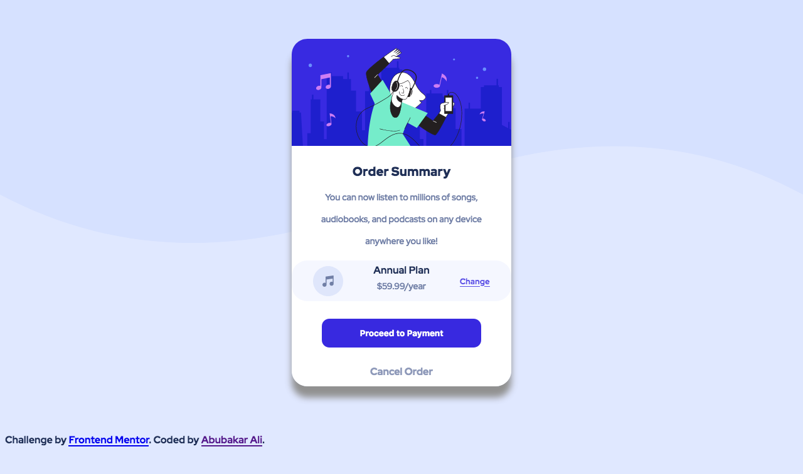

# Frontend Mentor - Order summary card solution

This is a solution to the [Order summary card challenge on Frontend Mentor](https://www.frontendmentor.io/challenges/order-summary-component-QlPmajDUj). Frontend Mentor challenges help you improve your coding skills by building realistic projects. 

## Table of contents

- [Overview](#overview)
  - [The challenge](#the-challenge)
  - [Screenshot](#screenshot)
  - [Links](#links)
- [My process](#my-process)
  - [Built with](#built-with)
  - [What I learned](#what-i-learned)
  - [Continued development](#continued-development)
  - [Useful resources](#useful-resources)
- [Author](#author)
- [Acknowledgments](#acknowledgments)

**Note: Delete this note and update the table of contents based on what sections you keep.**

## Overview

### The challenge

Users should be able to:

- See hover states for interactive elements

### Screenshot




### Links

- Solution URL: [Add solution URL here](https://your-solution-url.com)
- Live Site URL: [Add live site URL here](https://your-live-site-url.com)

## My process

### Built with

- Semantic HTML5 markup
- CSS custom properties
- Flexbox
- CSS Grid
- Mobile-first workflow
- Sass (scss)
- Node-sass 


### What I learned


`
```css
.proud-of-this-css {
  display: block;
  margin:auto; //centering an image in grid item
}
```


### Useful resources

- [Firefox](https://www.firefox.com) - The firefox dev tools are incredible , i would recommend it for anyone doing frontend development .


## Author

- Website - [Abubakar Ali](https://www.github.com/Devabubakar)
- Frontend Mentor - [@Devabubakar](https://www.frontendmentor.io/profile/Devabubakar)
- Twitter - [Devabubakar](https://www.twitter.com/Devabubakar)


## Acknowledgments

- ps;; I forgot how to align a div inside a div - got help from stackoverflow 

